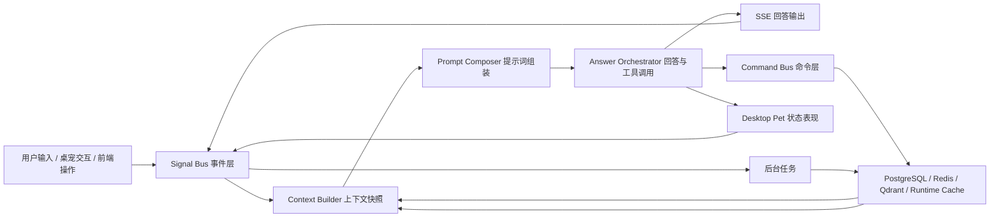

# 灵枢模块联动整体结构设计

日期：2026-06-12

## 目标

灵枢不应只是一个聊天窗口加几个独立功能页。回答、提示词、人设、桌面宠物、任务、日历、记忆和主动建议需要共享同一套状态循环，使任一模块的变化都能被其他模块感知并影响后续行为。

本设计目标是建立一个统一的模块联动结构：

- 回答会受人格、角色提示词、记忆、任务和权限影响。
- 人格会受用户反馈、长期记忆、任务习惯和回答评价影响。
- 桌面宠物会反映当前认知状态，也能触发事件和打开工作流。
- 任务和 Thought Queue 会吸收对话、记忆、日历和用户行为，形成主动建议。
- 所有联动通过明确的上下文快照、事件和命令完成，避免模块互相硬编码依赖。

## 当前代码基础

现有代码已经具备联动雏形：

- `crates/lingshu-server/src/routes/chat.rs` 在每轮对话前读取记忆、人格、角色提示词，并组装 system prompt。
- `crates/lingshu-server/src/llm/prompts.rs` 已集中管理人格提示词和 Thought Queue 提示词。
- `crates/lingshu-server/src/llm/thoughts.rs` 已能聚合最近对话、目标、任务和实体数量，生成主动建议。
- `crates/lingshu-server/src/state.rs` 中的 `PetNotification` 已可通过 WebSocket 向桌面宠物广播 mood 和附加数据。
- `crates/lingshu-server/src/telemetry.rs` 已有 append-only `signal_events`，可作为跨模块学习事件层。
- `frontend/src/components/avatar/petPresentation.ts` 和 `PetWindow.tsx` 已把人格参数映射到桌宠动画表现。

因此本设计不推翻现有架构，而是把这些分散联动收束成稳定边界。

## 总体结构



核心循环：

1. 用户输入、桌宠交互或前端操作进入 `Signal Bus`。
2. 每轮需要模型参与时，`Context Builder` 读取当前全局状态并形成 `ContextSnapshot`。
3. `Prompt Composer` 把身份、人设、角色提示词、记忆、任务、权限和当前桌宠状态拼成模型可用上下文。
4. `Answer Orchestrator` 调用 LLM 和工具，输出回答、命令和桌宠状态变化。
5. `Command Bus` 执行任务、日历、权限、自动化等真实操作。
6. `Signal Bus` 记录结果和反馈。
7. 后台任务根据事件更新记忆、人设、Thought Queue 和遗忘状态。

## 模块职责

### Context Builder

职责：在每轮对话或主动建议生成前，创建只读上下文快照。

建议新增结构：

```rust
pub struct ContextSnapshot {
    pub user_id: Uuid,
    pub now: DateTime<Utc>,
    pub memory_context: String,
    pub active_personality: PersonalityValues,
    pub role_prompt: String,
    pub style_exemplars: String,
    pub active_tasks: Vec<TaskContext>,
    pub calendar_context: Vec<CalendarContext>,
    pub pending_thoughts: Vec<ThoughtContext>,
    pub permissions: PermissionSettings,
    pub pet_state: Option<PetRuntimeState>,
}
```

边界要求：

- 只负责读取和整理，不做写入。
- 对外提供稳定结构，避免 `chat.rs` 直接散落多个查询。
- 对不同调用场景提供裁剪版本，例如 `for_chat`、`for_thoughts`、`for_pet_notification`。

### Prompt Composer

职责：把 `ContextSnapshot` 转换成 LLM system prompt 和工具策略说明。

输入：

- 基础身份 prompt。
- 用户自定义角色提示词。
- 人格参数说明。
- 相关记忆和风格样本。
- 当前任务、日历、Thought Queue 摘要。
- 权限边界和可用工具。

输出：

- `system_prompt`
- `tool_policy_prompt`
- `response_style_hint`

设计要求：

- 用户角色提示词可以覆盖默认身份中冲突的表达风格，但不能覆盖安全边界和工具真实性规则。
- 人格参数影响语气、详略、主动性和风险偏好。
- 任务和日历上下文只注入与当前请求相关或高优先级的内容，避免 prompt 过载。

### Answer Orchestrator

职责：处理一轮回答的完整生命周期。

流程：

1. 接收用户消息。
2. 获取 `ContextSnapshot`。
3. 通过 `Prompt Composer` 生成 prompt。
4. 执行工具调用循环。
5. 通过 SSE 输出回答。
6. 持久化消息和工具结果。
7. 发送桌宠状态事件。
8. 派发后台任务。

现有 `chat.rs` 已承担这些职责。后续应逐步拆出：

- `context.rs`
- `prompt_composer.rs`
- `orchestrator.rs`
- `post_stream_jobs.rs`

这样 `chat.rs` 保持为 HTTP handler，而不是业务中枢。

### Signal Bus

职责：记录跨模块学习事件，是人格、记忆、主动建议和行为统计的共同输入。

已有 `signal_events` 可以继续作为基础。建议扩展事件类型：

- `task_created`
- `task_completed`
- `task_deferred`
- `calendar_event_confirmed`
- `calendar_event_deleted`
- `pet_opened_main_window`
- `pet_suggestion_clicked`
- `role_prompt_updated`
- `permission_granted`
- `permission_denied`

事件规则：

- 所有事件 append-only。
- 事件可以引用实体类型和实体 ID。
- metadata 不存原始敏感正文，只存标签、计数、来源和必要摘要。
- 服务端关键事件必须由后端写入，前端只能提交白名单事件。

### Command Bus

职责：执行会改变系统状态的动作。

命令类型：

- `CreateTask`
- `UpdateTask`
- `CompleteTask`
- `CreateCalendarEvent`
- `DeleteCalendarEvent`
- `OpenApp`
- `OpenUrl`
- `RequestPermission`
- `ShowPetNotification`
- `UpdateRolePrompt`

设计要求：

- 回答模块不能直接说“已完成”而不经过命令结果。
- 每个命令明确权限等级、确认策略和审计信息。
- 高风险命令必须先产出确认请求，再执行真实动作。

### Personality Engine

职责：维护可演化人格。

输入：

- 用户手动滑块。
- 回复点赞、点踩和风格标签。
- 长期记忆。
- 任务处理偏好，例如用户经常推迟任务或喜欢短提醒。
- Thought Queue 接受和拒绝记录。

输出：

- 新的人格快照。
- 对 prompt 的风格约束。
- 对桌宠动画的视觉修饰。
- 对主动建议频率的影响。

联动规则：

- `proactivity` 高：更容易生成 Thought Queue，也更倾向主动补充建议。
- `risk_tolerance` 低：任务、日历、删除类操作更保守，确认文案更明确。
- `verbosity` 高：回答和任务说明更详细。
- `warmth` 与 `humor` 高：桌宠动画更活跃，回答结束后更容易进入 `happy`。

### Desktop Pet

职责：桌面宠物是状态表现层和轻交互入口，不只是动画装饰。

输入：

- `mood`：`idle`、`thinking`、`speaking`、`happy`、`sleepy`。
- `personality`：人格参数影响动画速度、脉冲、回弹、视线频率。
- `notification`：日历提醒、任务建议、Thought Queue。
- `action_url`：点击后打开主窗口或跳转到对应功能区。

输出：

- 用户点击、拖拽、打开建议、关闭提醒等事件。
- 桌宠可见性、空闲状态和勿扰状态。

设计要求：

- 宠物状态由后端统一广播，前端负责表现。
- 宠物点击不直接修改业务数据，只派发事件或打开确认流。
- 宠物可以承载低打扰提醒，但不能绕过权限确认。

### Task And Thought Engine

职责：把对话、记忆、项目、日历和用户行为转成可执行建议。

任务模块处理确定性事项：

- 明确任务。
- 截止日期。
- 完成状态。
- 依赖关系。

Thought Queue 处理主动建议：

- 建议把任务排进日历。
- 提醒任务堆积。
- 建议记录高价值记忆。
- 提醒冲突或遗漏。
- 根据用户偏好调整建议措辞和频率。

二者关系：

- Thought 可以转成 Task 或 Calendar Event。
- Task 状态变化会进入 Signal Bus，影响后续 Thought 生成。
- 用户拒绝某类 Thought 会降低相似建议频率。

## 典型联动流程

### 用户创建提醒

1. 用户说：“明天下午提醒我提交报告。”
2. `Context Builder` 读取人格、权限、日历和相关任务。
3. `Prompt Composer` 注入日历工具规则和当前权限。
4. `Answer Orchestrator` 调用日历创建工具。
5. `Command Bus` 创建待确认日历事件。
6. 桌宠进入 `thinking`，流式输出时进入 `speaking`，完成后回到 `idle` 或 `happy`。
7. `Signal Bus` 记录日历创建和用户意图。
8. 后台任务抽取“提交报告”相关记忆或任务线索。

### 用户接受主动建议

1. Thought Queue 生成“要不要给报告安排一个时间块”。
2. 桌宠显示低打扰提醒。
3. 用户点击接受。
4. `Signal Bus` 记录 `thought_accepted`。
5. `Command Bus` 进入日历确认流。
6. `Personality Engine` 记录用户接受主动安排，轻微提高相关主动性。

### 用户反馈回答太长

1. 用户对某条回复打上“太长”标签。
2. `Signal Bus` 记录 `reply_style_tag`。
3. `Personality Engine` 下次演化时降低 `verbosity` 或加入风格样本。
4. `Prompt Composer` 下一轮生成更短回答。
5. 桌宠不需要强提示，但可保持更克制动画表现。

## 数据与权限边界

必须坚持三条边界：

- 读上下文和写业务状态分开：`Context Builder` 不写数据库。
- 模型建议和真实操作分开：LLM 只能提出工具调用或命令意图，最终由 `Command Bus` 执行。
- 表现和权限分开：桌宠可以提示和引导，但不能绕过 L1-L4 权限。

权限建议：

- L0：聊天、记忆读取、普通建议。
- L1：日历创建、修改、删除确认流。
- L2：打开 App、文件、URL。
- L3：屏幕阅读、辅助功能读取。
- L4：自主点击和复杂自动化。

## 实施顺序

建议分四步推进：

1. 抽出 `ContextSnapshot` 和 `ContextBuilder`，让 `chat.rs` 不再直接拼散落上下文。
2. 抽出 `PromptComposer`，把基础身份、角色提示词、人格、记忆、任务和权限统一组合。
3. 扩展 `SignalEventType` 和客户端事件，把任务、日历、桌宠和角色提示词事件接入同一事件层。
4. 引入 `Command Bus`，把工具执行结果、权限确认、审计和桌宠通知统一建模。

每一步都可以独立测试和回滚，不需要一次性重写。

## 测试策略

后端测试：

- `ContextBuilder` 在缺少 Redis 或 Qdrant 时仍能生成可用快照。
- `PromptComposer` 按人格、角色提示词和权限生成稳定片段。
- `Command Bus` 对不同权限等级产出正确确认或拒绝结果。
- `Signal Bus` 只接受白名单前端事件，服务端事件可正常写入。
- Thought Queue 接受、拒绝、延后会影响后续生成。

前端测试：

- 桌宠收到 mood 和 personality payload 后正确更新动画状态。
- 桌宠点击建议时只打开确认流，不直接执行高风险操作。
- 任务、日历和 Thought Queue 的 UI 操作能写入对应 signal。

端到端验证：

- 对话创建日历后，回答、数据库、桌宠状态和 signal_events 一致。
- 接受 Thought 后能进入任务或日历确认流。
- 点踩或风格标签会影响后续 prompt 片段。

## 非目标

本设计不要求立即实现以下内容：

- 完整重写聊天路由。
- 新增复杂前端页面。
- 让桌宠直接执行高风险操作。
- 让 LLM 自行决定绕过权限。
- 把所有历史数据一次性迁移到新结构。

## 结论

灵枢的整体结构应以 `ContextSnapshot` 为读模型，以 `Signal Bus` 为学习输入，以 `Command Bus` 为真实操作边界，以 `Desktop Pet` 为状态表现和轻交互入口。这样回答、提示词、人设、桌面宠物、任务、日历和记忆都可以相互影响，但不会形成不可维护的双向硬依赖。
